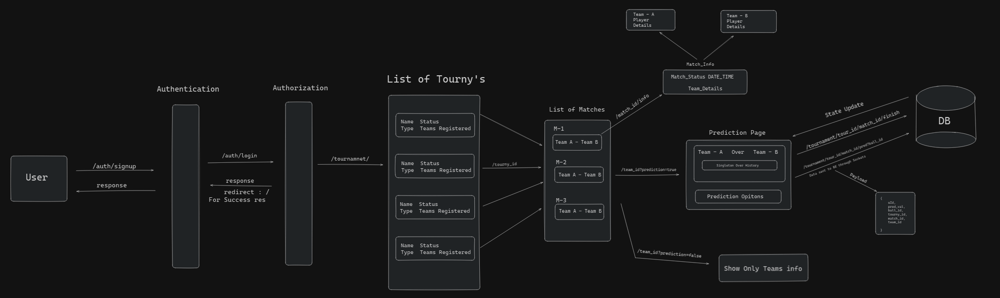

## Schema Design


## Flow Diagram


🔗 FlowChart/designs: https://excalidraw.com/#json=c3Hy1G8Jz0fCT5JR1UbRR,0XXZ7YPnOIelbPgwp3Vj6Q

# Set Up Project Locally

- Clone the repository.
- Go to main directory.
- Run `npm install` to install all dependencies.
- To run the server, run `npm run dev`.

## For DATABASE Config:
- We've used `PostgreSQL` as our database.
- For ORM, we've used `Sequelize`.
- For migrations, we've used `sequelize-cli`.
- DB Drivers used: `pg` and `pg-hstore`.
- For DB Config, you can find config in `config/config.json` file.

### For Setting Up Database Config:
- dependencies: `npm install pg pg-hstore sequelize sequelize-cli`
- go to main directory like in our case it's server directory.
- run `npx sequelize init` to create `config`.
- Now, you can find `config/config.json` file.
- Update the config file with your database credentials.

### config.json sample file,
```
{
  "development": {
    "username": "your_postgres_user",
    "password": "your_password",
    "database": "your_database_development",
    "host": "127.0.0.1",
    "dialect": "postgres"
  },
  "test": {
    "username": "your_postgres_user",
    "password": "your_password",
    "database": "your_database_test",
    "host": "127.0.0.1",
    "dialect": "postgres"
  },
  "production": {
    "username": "your_postgres_user",
    "password": "your_password",
    "database": "your_database_production",
    "host": "127.0.0.1",
    "dialect": "postgres"
  }
}
```

# API Endpoints

## Authentication & OAuth

### Google OAuth
- `GET /google/callback` → Handles Google OAuth authentication.

### Register & Login
- `POST /register` → User registration. *(Validates input before registering.)*
- `POST /login` → User login.

### Logout
- `GET /logout` → Logs out the user. *(Requires authentication.)*

---

## Tokens & Verification

### Dummy Tokens
- `GET /dummy` → Returns dummy tokens for testing.

### Token Management
- `POST /refresh-token` → Refreshes the access token.

### Email Verification
- `POST /verify-email` → Verifies a user's email.
- `POST /resend-email` → Resends verification email.
- `GET /check-verification` → Checks if a user is verified.

---

## Notes
- Protected routes require authentication (`isAuthenticated` middleware).
- Ensure valid tokens are used where necessary.

# Admin API Endpoints

## Authentication

### Admin Register & Login
- `POST /register` → Admin registration. *(Validates input before registering.)*

### Logout
- `GET /logout` → Logs out the admin. *(Requires authentication.)*

---

## Teams Management

### Team Operations
- `POST /team` → Create a new team. *(Validates input before creation.)*
- `GET /team` → Get teams belonging to a tournament.
- `GET /teams` → Fetch all teams.
- `GET /team/:teamId?isPopulate=true` → Get Info of Team Players.
- `GET /team/:teamId` → Fetch details of a specific team.
- `PUT /team` → Update team information.
- `DELETE /team` → Delete a team.

---

## Players Management

### Player Operations
- `POST /player` → Create a new player. *(Validates input before creation.)*
- `DELETE /player` → Delete a player.
- `GET /players` → Fetch all players.
- `GET /player/:playerId` → Fetch details of a specific player.
- `POST /assign-player` → Assign a player to a team.
- `POST /assign-player/:playerId&:teamId&isRemove=true` → Remove player from the team.

---

## Tournament Management

### Tournament Operations
- `POST /tournament` → Create a new tournament. *(Validates input before creation.)*
- `DELETE /tournament` → Delete a tournament.
- `GET /tournament/:tournamentId` → Fetch details of a specific tournament.
- `GET /tournaments` → Fetch all tournaments.
- `GET /tournament/team` → Fetch teams in a tournament.
- `POST /tournament/team` → Add a team to a tournament. *(Requires `tournamentId` as a query parameter.)*

---

## Notes
- Protected routes require authentication (`isAuthenticated` middleware).
- Ensure valid tokens are used where necessary.

